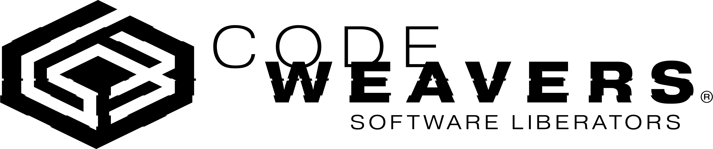

  # Whisky 🥃
  *Modern Wine + GPTK wrapper for macOS*
  
  
  

## Fork Status

This fork modernizes the original project with maintained runtime sources and refreshed UI polish.

Familiar UI that integrates seamlessly with macOS

  

  One-click bottle creation and management

Debug and profile with ease

---

Whisky provides a clean and easy-to-use graphical wrapper for Wine built in native SwiftUI. You can make and manage bottles, install and run Windows apps and games, and unlock the full potential of your Mac with no technical knowledge required.

This fork now resolves runtime packages from maintained sources, prioritizing the latest releases from [Gcenx/game-porting-toolkit](https://github.com/Gcenx/game-porting-toolkit) and falling back to legacy archives when needed.

Translated on [Crowdin](https://crowdin.com/project/whisky).

---

## System Requirements
- CPU: Apple Silicon (M-series chips)
- OS: macOS Sonoma 14.0 or later

## Installation

Build from source in Xcode for now. Homebrew instructions from upstream may point to the archived build.

## My game isn't working!

Some games need special steps to get working. Check out the [wiki](https://github.com/IsaacMarovitz/Whisky/wiki/Game-Support).

---

## Credits & Acknowledgments

Whisky is possible thanks to the magic of several projects:

- [msync](https://github.com/marzent/wine-msync) by marzent
- [DXVK-macOS](https://github.com/Gcenx/DXVK-macOS) by Gcenx and doitsujin
- [MoltenVK](https://github.com/KhronosGroup/MoltenVK) by KhronosGroup
- [Sparkle](https://github.com/sparkle-project/Sparkle) by sparkle-project
- [SemanticVersion](https://github.com/SwiftPackageIndex/SemanticVersion) by SwiftPackageIndex
- [swift-argument-parser](https://github.com/apple/swift-argument-parser) by Apple
- [SwiftTextTable](https://github.com/scottrhoyt/SwiftyTextTable) by scottrhoyt
- [Game Porting Toolkit releases](https://github.com/Gcenx/game-porting-toolkit) by Gcenx
- [CrossOver](https://www.codeweavers.com/crossover) by CodeWeavers and WineHQ
- D3DMetal by Apple

Special thanks to Gcenx, ohaiibuzzle, and Nat Brown for their support and contributions!

---

<table>
  <tr>
    <td>
        <picture>
          <source media="(prefers-color-scheme: dark)" srcset="./images/cw-dark.png">
          
        </picture>
    </td>
    <td>
        Whisky wouldn't exist without CrossOver. Support the work of CodeWeavers using our <a href="https://www.codeweavers.com/store?ad=1010">affiliate link</a>.
    </td>
  </tr>
</table>
